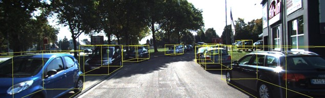

# PointPillars with GPU, FPGA with Vitis AI, and FPGA with FINN (Team1)
- By 陳奕達, 戴妤珊, 蔡岳峰

## Introduction
In this final project, we aim to observe the differences from different platforms and different implementation methods. We will implement the 3D object detection on the GPUs, FPGAs with Vitis AI, and FPGAs with FINN, and compare the performance difference among them with the PointPillars model on the `ZCU104` board.

## Folder structure
```
.
|-- ...
|-- docs/  # Documentation for the entire project, including the final report and the presentation slides
|-- build/ # The build file of the FINN and Vitis AI
    |-- FINN # The prebuild file of FINN_PointPillars
        |-- build.petalinux.2020.2.aarch64.Debug # Build files from source 
        |-- FINN_prebuild # Build files from the github of https://github.com/vision-agh/pp-finn
    |-- FPGA # Prebuild files for FPGA optimization
    |-- Vitis_AI # Prebuild files for Vitis_AI PointPillars, can be directly executed on ZCU104 environment
|-- src/
    |-- FINN_main # The source code for building up the FINN-based PointPillars
    |-- Vitis_AI # The source code for building up the VitisAI-based PointPillars
|-- impl_result # Result of the GPU and Vitis AI
|-- README.md # Readme for this project
|-- LICENSE # Open source license
```

## Build Setup
### GPU
1. Requires nvidia-driver and CUDA for GPU acceleration 
2. Create a `conda` environment for `python3.8`
3. cd into the `src/PointPillars_gpu`
4. Install the reqired packages from the `requirements.txt`
```
pip3 install -r requirements.txt
```

### Vitis AI and FINN
1. Download the PetaLinux image file [ZCU104](https://www.xilinx.com/bin/public/openDownload?filename=xilinx-zcu104-dpu-v2020.2-v1.3.1.img.gz) and flash it onto the SD card with `balenaEtcher` with proper partition

## Run test
### GPU
```
cd ./src/PointPillars_gpu/
python evaluate.py --ckpt pretrained/epoch_160.pth --data_root your_path_to_kitti 
```
### Vitis AI
```
cd ./build/Vitis_AI/pointpillars/

env XLNX_POINTPILLARS_PRE_MT=1 ./test_bin_pointpillars pointpillars_kitti_12000_0_pt pointpillars_kitti_12000_1_pt sample_pointpillars.bin  sample_pointpillars.png 

env XLNX_POINTPILLARS_PRE_MT=1 ./test_accuracy_pointpillars pointpillars_kitti_12000_0_pt  pointpillars_kitti_12000_1_pt  bin.list rgb.list calib.list result

env XLNX_POINTPILLARS_PRE_MT=1 ./test_performance_pointpillars pointpillars_kitti_12000_0_pt  pointpillars_kitti_12000_1_pt  -t 1 -s 30 bin.list
```
### FINN
```
cd ./build/FINN/FINN_prebuild/
./test.sh
```

## Result
### Visualization
#### GPU


#### Vitis AI




## Reference
* [Pointpillars: Fast encoders for object detection from point clouds](https://openaccess.thecvf.com/content_CVPR_2019/html/Lang_PointPillars_Fast_Encoders_for_Object_Detection_From_Point_Clouds_CVPR_2019_paper.html)
* [Implementation of the pointpillars network for 3D object detection in reprogrammable heterogeneous devices using FINN](https://link.springer.com/article/10.1007/s11265-021-01733-4)
* [https://github.com/vision-agh/pp-finn.git](https://github.com/vision-agh/pp-finn.git)
* [https://github.com/Xilinx/Vitis-AI.git](https://github.com/Xilinx/Vitis-AI.git)