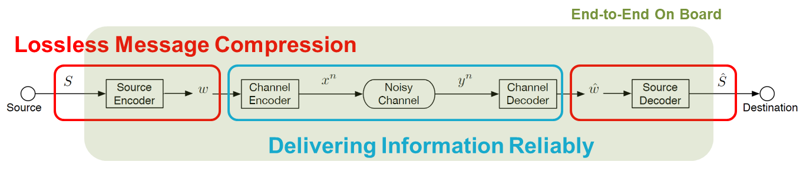
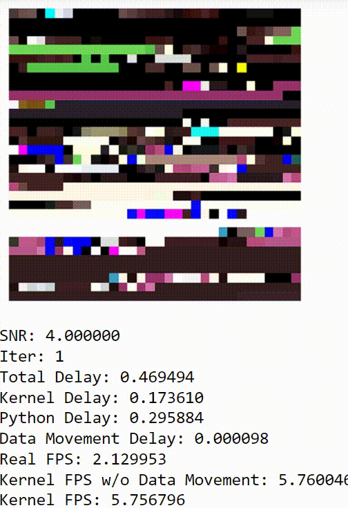
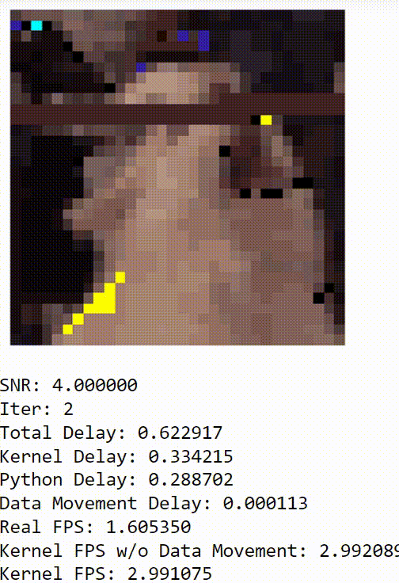
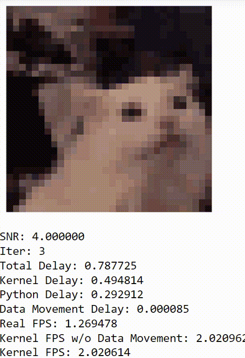
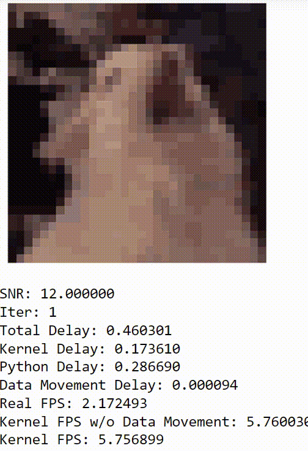

# Project Goal
### Full run including Encoding, Channel Simulation, and Decoding
## This Project contains three modules below
#### a.	Source Coding (Image Compression) – QOI (Quite OK Image Format)
#### b.	Channel Coding (Error Correction Code) – Polar Code
#### c.	Simulated AWGN Channel

## DEMO
#### &ensp; Low SNR / Low Iter &emsp;&emsp;&nbsp; Low SNR / Moderate Iter &emsp;&emsp;&nbsp; Low SNR / High Iter &emsp;&emsp;&emsp; High SNR / Low Iter
 &emsp;  &emsp;  &emsp; 
### Code Structure
```
| -- README.md # overview of the project
| -- build/ # build scripts – bitstream generation
| -- docs/ # Documentation files – ppt, pdf, md
| -- src/ # Source files, include kernel & host code, cpp, hpp, other include files
| -- data/ # data files used in the project, include input test data and output result data
| -- impl_result/ # implementation result files, includes
